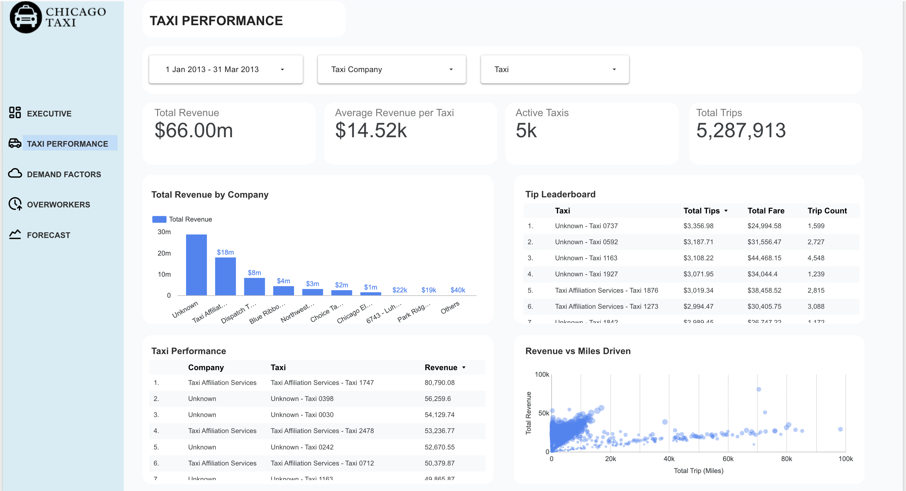
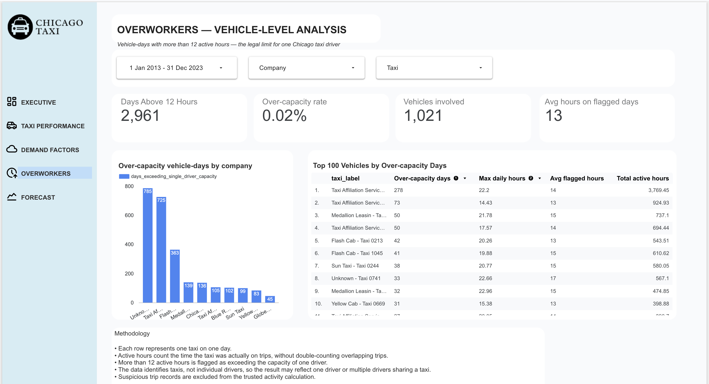
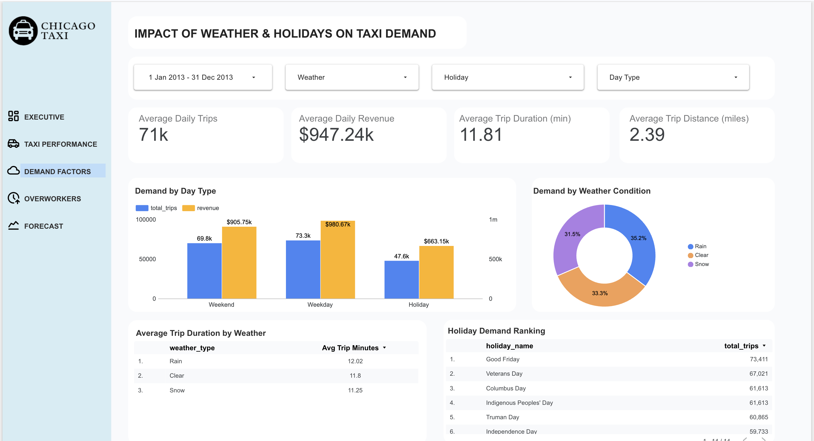
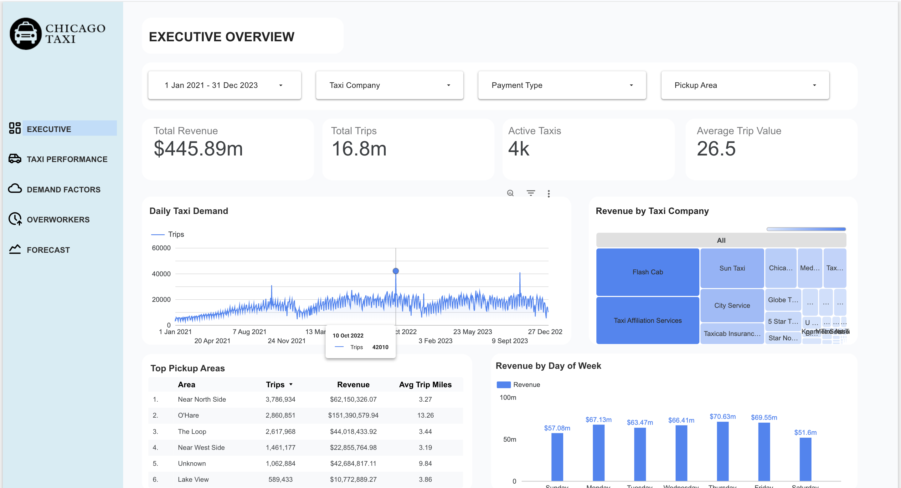
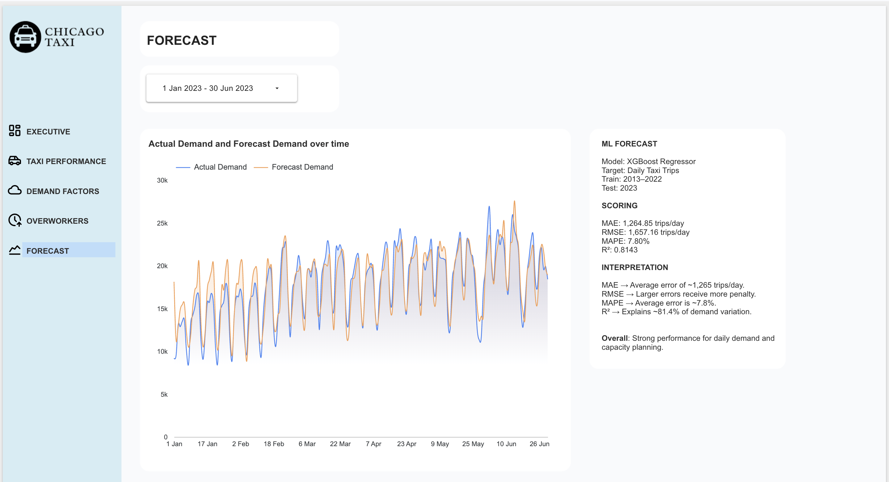

# Chicago Taxi Data Engineering & Analytics

This project builds an end-to-end data engineering and analytics pipeline using Chicago Taxi Trips data. The pipeline covers data ingestion, Bronze/Silver/Gold transformation, data quality checks, analytics modelling, forecasting, and Looker Studio dashboards.

## Dashboard

**Looker Studio:**  
[Open Looker Dashboard](https://datastudio.google.com/reporting/e82a4c71-f15b-4b32-9e04-e90dc1574f1a)

## Architecture

This project follows a **Medallion Architecture**:

**Bronze → Silver → Data Quality Gate → Gold → ML / Reporting → Looker Studio**

- **Bronze** — Raw and ingested data
- **Silver** — Cleaned and standardized data
- **Data Quality Gate** — Dataform assertions validate the data
- **Gold** — Business-ready analytical models and reporting tables
- **ML** — XGBoost demand forecasting
- **Looker Studio** — Business dashboards and reporting

```mermaid
flowchart LR
    %% ================= EXTERNAL SOURCES =================
    subgraph SRC["EXTERNAL SOURCES"]
        SRC_TAXI["BigQuery public data<br/>chicago_taxi_trips 2013-2023"]
        SRC_WX["Open-Meteo Archive API<br/>Chicago daily weather"]
        SRC_HOL["Nager.Date API<br/>US public holidays"]
    end

    %% ================= INGESTION =================
    subgraph ING["PYTHON INGESTION"]
        ING_WX["fetch_weather.py<br/>WRITE_TRUNCATE load"]
        ING_HOL["fetch_holidays.py<br/>WRITE_TRUNCATE load"]
    end

    %% ================= BRONZE =================
    subgraph BRZ["BRONZE - RAW / INGESTED"]
        RAW_TAXI["raw_taxi_trips<br/>raw trip landing"]
        RAW_WX["raw_weather<br/>raw daily weather"]
        RAW_HOL["raw_holidays<br/>raw holiday rows"]
    end

    %% ================= SILVER =================
    subgraph SIL["SILVER - CLEANED / STANDARDIZED"]
        STG_TAXI["stg_taxi_trips<br/>dedup - Chicago TZ - plausibility flags"]
        STG_WX["stg_weather<br/>typed - 1 row per date"]
        STG_HOL["stg_holidays<br/>distinct - is_holiday flag"]
    end

    %% ================= DATA QUALITY GATE =================
    subgraph DQ["DATA QUALITY GATE - 14 DATAFORM ASSERTIONS"]
        DQ_TAXI["taxi x6 on stg_taxi_trips<br/>unique key - positives - valid timestamps"]
        DQ_VEH["vehicle x1 on vehicle_activity_day<br/>active-minutes bounded"]
        DQ_WX["weather x5 on stg_weather<br/>1 row/date - temps - precip >= 0"]
        DQ_HOL["holidays x2 on stg_holidays<br/>1 row/date - date not null"]
    end

    %% ================= GOLD (ONE CONTAINER) =================
    subgraph GOLD["GOLD - BUSINESS-READY / ANALYTICS"]
        subgraph GDIM["DIMENSIONS"]
            DW["dim_weather<br/>conformed daily weather"]
            DH["dim_holiday<br/>conformed holidays"]
            DCA["dim_chicago_community_area<br/>77 areas - hardcoded"]
        end
        subgraph GFCT["FACTS"]
            FTT["fact_taxi_trip<br/>trip-grain trusted fact"]
            FDM["fact_daily_demand<br/>1 row/day - trips x wx x holiday"]
        end
        subgraph GANA["ANALYTICAL MODELS"]
            VAD["vehicle_activity_day<br/>taxi x day active-time model"]
            PG["pickup_geospatial<br/>pickup metrics per area x day"]
        end
        subgraph GREP["REPORT MARTS"]
            EXEC["executive_dashboard<br/>executive OBT for Looker"]
            BI2["business_insight_2<br/>taxi company performance"]
            TE["tip_earners<br/>daily tips per taxi"]
            HWI["holiday_weather_impact<br/>holiday vs weekday vs weekend"]
            OVW["overworkers<br/>vehicle-day utilization"]
            FCD["forecast_dashboard<br/>actuals + ML predictions"]
            BI1["business_insight_1<br/>daily ops KPIs - no consumer yet"]
            FE["forecast_features<br/>daily ML features - no consumer yet"]
        end
    end

    %% ================= ML =================
    subgraph ML["ML - XGBOOST FORECASTING (PYTHON)"]
        MLP["train.py / predict.py / evaluate.py<br/>lag_1 - lag_7 - rolling_7d features<br/>train < 2023 - predict 2023"]
        MPU["upload_predictions.py"]
        MP["ml.model_predictions<br/>declared in Dataform"]
    end

    %% ================= LOOKER =================
    subgraph LKR["LOOKER STUDIO - BI"]
        LK["Looker Studio dashboards<br/>Executive - Taxi Performance<br/>Demand Factors - Overworkers<br/>Forecast"]
    end

    %% ---- sources -> ingestion -> bronze ----
    SRC_TAXI -->|"dataform query - no script"| RAW_TAXI
    SRC_WX --> ING_WX --> RAW_WX
    SRC_HOL --> ING_HOL --> RAW_HOL

    %% ---- bronze -> silver ----
    RAW_TAXI --> STG_TAXI
    RAW_WX --> STG_WX
    RAW_HOL --> STG_HOL

    %% ---- quality gate (control, not data) ----
    SIL -.->|"validated by"| DQ
    DQ -.->|"fail blocks build"| GOLD

    %% ---- silver -> gold (data lineage) ----
    STG_TAXI --> FTT
    STG_TAXI --> VAD
    STG_WX --> DW
    STG_HOL --> DH
    STG_TAXI --> PG
    STG_WX --> PG
    STG_HOL --> PG
    DCA --> PG

    %% ---- gold internal ----
    FTT --> FDM
    DW --> FDM
    DH --> FDM
    FTT --> EXEC
    DW --> EXEC
    DH --> EXEC
    DCA --> EXEC
    FTT --> BI1
    FTT --> BI2
    FTT --> TE
    FTT --> FE
    VAD --> OVW
    FDM --> HWI
    FDM --> FCD

    %% ---- ML loop ----
    FDM -->|"direct BQ read"| MLP
    MLP --> MPU --> MP
    MP -->|"ref() declaration"| FCD

    %% ---- gold reports -> looker ----
    EXEC --> LK
    BI2 --> LK
    TE --> LK
    HWI --> LK
    OVW --> LK
    FCD --> LK
    PG --> LK

    %% ================= STYLING =================
    classDef src fill:#e8eaed,stroke:#5f6368,color:#202124
    classDef bronze fill:#fce8e6,stroke:#c5221f,color:#202124
    classDef silver fill:#e8f0fe,stroke:#1a73e8,color:#202124
    classDef gold fill:#fef7e0,stroke:#f9ab00,color:#202124
    classDef report fill:#e6f4ea,stroke:#137333,color:#202124
    classDef ml fill:#f3e8fd,stroke:#8430ce,color:#202124
    classDef bi fill:#0047ab,stroke:#0047ab,color:#ffffff
    classDef gate fill:#ffffff,stroke:#d93025,color:#d93025,stroke-dasharray:3 3

    class SRC_TAXI,SRC_WX,SRC_HOL,ING_WX,ING_HOL src
    class RAW_TAXI,RAW_WX,RAW_HOL bronze
    class STG_TAXI,STG_WX,STG_HOL silver
    class DW,DH,DCA,FTT,FDM,VAD,PG gold
    class EXEC,BI1,BI2,TE,HWI,OVW,FCD,FE report
    class MLP,MPU,MP ml
    class LK bi
    class DQ_TAXI,DQ_VEH,DQ_WX,DQ_HOL gate

```



---

# Assessment Questions

## 1. Who are the top 100 "tip earners"?

**Question:**  
Who are the top 100 "tip earners", the taxi IDs that earn more money than others for the last 3 months?

**Answer:**  
The Top 100 tip earners are ranked by total tips earned over the last three months. More trips do not always mean higher tips or revenue because some taxis earn more per trip. A taxi with fewer trips can still generate higher total revenue and tips if its average fare and tip per trip are higher.

### Dashboard



---

## 2. Who are the top 100 "overworkers"?

**Question:**  
Who are the top 100 "overworkers", taxi IDs that work more hours than others without taking at least 8 hours break and regularly have a long shift? When answering, make sure to consider the shifts that taxi drivers might typically work.

**Answer:**  
The top 100 "overworkers" are the 100 taxi IDs with the most calendar days where the vehicle recorded more than 12 active hours. For each taxi-day, overlapping trips were merged so the same time was not counted twice, and clearly implausible trip-duration records were excluded from the trusted activity calculation. Vehicles were then ranked by the number of days above 12 active hours, with maximum daily active hours and average hours on flagged days used to show the severity and repetition of extended activity.

The 8-hour-break requirement was also considered, but the dataset does not contain a driver ID. Therefore, an 8-hour gap in taxi activity cannot prove that a specific driver took an 8-hour break because the same vehicle may be shared by multiple drivers. The final ranking therefore identifies vehicles with repeated extended operation using 12 active hours as the single-driver capacity threshold.

### Dashboard



---

## 3. Did US public holidays affect taxi trips?

**Question:**  
Do you think the public holidays in the US had an impact on the increase/decrease in trips?

**Answer:**  
Yes. Public holidays were associated with a clear decrease in taxi trips in 2013. Holiday days averaged about **47.6K trips per day**, compared with **73.3K on weekdays**, which is roughly **35% fewer trips**. Holiday revenue was also lower at about **$663K per day**, compared with approximately **$981K on weekdays**.

### Dashboard



---

# Bonus Insights

## 4. Recurring Mid-October Demand Spike

### Insight

Daily taxi demand shows a recurring spike around **10–20 October** across multiple years, consistently higher than surrounding periods.

### Business Value

The operator can anticipate this recurring seasonal demand and increase driver availability and fleet capacity during this period to reduce unmet demand and improve service availability.

### Supporting Evidence

- Daily demand trend across multiple years
- Consistent demand increase around 10–20 October
- Comparison against surrounding October dates



---

## 5. Demand Forecasting for Capacity Planning

### Insight

The XGBoost model forecasts daily taxi demand using historical demand, calendar, holiday, and weather features.

### Business Value

Forecasts can help planners anticipate high- and low-demand days and adjust driver availability and fleet capacity before demand occurs.



---

# Key Takeaways

- **Tip earners:** Higher trip volume does not necessarily mean higher tips or revenue; higher-value trips can produce more revenue and tips.
- **Overworkers:** The strongest evidence available from the dataset is repeated vehicle-days exceeding 12 active hours.
- **Public holidays:** Holiday demand was around **35% lower than weekday demand in 2013**.
- **Seasonality:** Taxi demand shows recurring periods of higher activity that can support capacity planning.
- **Forecasting:** Machine learning can help anticipate future demand and support operational planning.

---

# Technology Stack

- **Google BigQuery** — Data warehouse
- **Dataform** — SQL transformations and modelling
- **Looker Studio** — Analytics and dashboards
- **Python** — Data processing, research and forecasting
- **XGBoost** — Demand forecasting
- **Git / GitHub** — Version control

---

# Project Structure

```text
taxi-data-engineering/
├── definitions/
│   ├── bronze/
│   ├── silver/
│   ├── gold/
│   └── assertions/
├── bigquery/
│   ├── profiling/
│   └── validation/
├── docs/
│   ├── images/
│   ├── business_rules.md
│   ├── bronze_profile.md
│   ├── anomalies.md
│   └── ml_evaluation.md
├── ingestion/
├── ml/
├── flowchart.md
├── README.md
└── workflow_settings.yaml
```