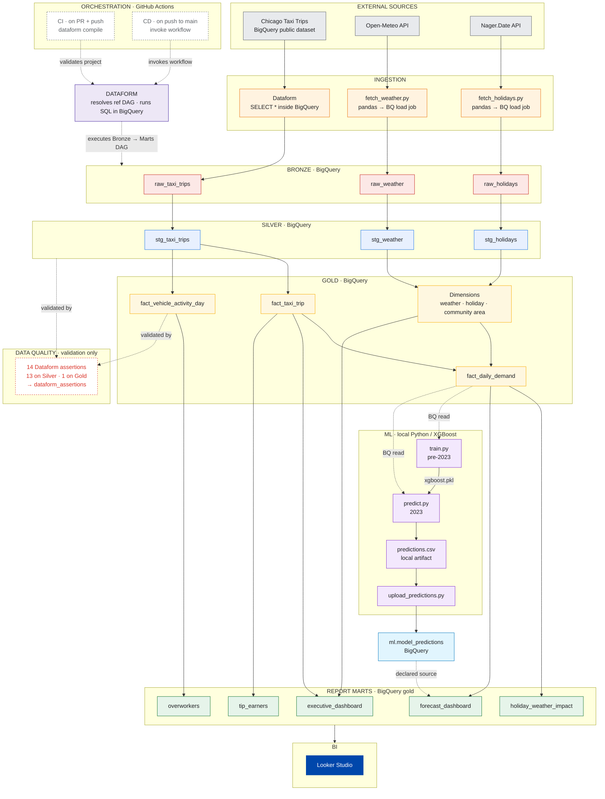
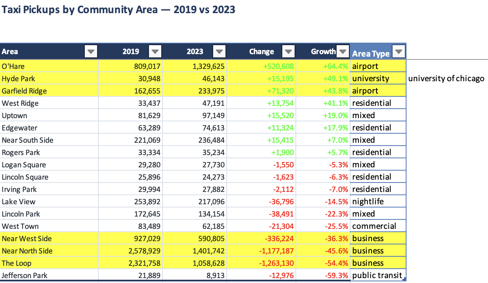

# Chicago Taxi Data Engineering & Analytics

This project builds an end-to-end data engineering and analytics pipeline using Chicago Taxi Trips data. It covers data ingestion, Bronze/Silver/Gold transformations, data quality checks, analytics modelling, forecasting, CI/CD with GitHub Actions, and Looker Studio dashboards.


## Dashboard

**Looker Studio:**  
[Open Looker Dashboard](https://datastudio.google.com/reporting/e82a4c71-f15b-4b32-9e04-e90dc1574f1a)

## Architecture

This project follows a **Medallion Architecture**:

**Bronze → Silver → Data Quality Gate → Gold → ML / Reporting → Looker Studio**

- **Bronze** — Raw and ingested data
- **Silver** — Cleaned and standardized data
- **Data Quality Gate** — Dataform assertions validate the data
- **Gold** — Business-ready analytical models and reporting tables
- **ML** — XGBoost demand forecasting
- **Looker Studio** — Business dashboards and reporting



---

# Assessment Questions

## 1. Who are the top 100 "tip earners"?

**Question:**  
Who are the top 100 "tip earners", the taxi IDs that earn more money than others for the last 3 months?

**Answer:**  
Can refer Snapshot on Tip Leaderboard panel. Top 100 tip earners are ranked by total tips earned over the last three months. More trips do not always mean higher tips or revenue because some taxis earn more per trip. A taxi with fewer trips can still generate higher total revenue and tips if its average fare and tip per trip are higher.

### Dashboard


---

## 2. Who are the top 100 "overworkers"?

**Question:**  
Who are the top 100 "overworkers", taxi IDs that work more hours than others without taking at least 8 hours break and regularly have a long shift? When answering, make sure to consider the shifts that taxi drivers might typically work.

**Answer:**  
Top 100 "overworkers" are the 100 taxi IDs with the most calendar days where the vehicle recorded more than 12 active hours. For each taxi-day, overlapping trips were merged so the same time was not counted twice, and clearly bad trip-duration records were excluded from the trusted activity calculation. Vehicles were then ranked by the number of days above 12 active hours, with maximum daily active hours and average hours on flagged days used to show the severity and repetition of extended activity.

8h break requirement was also considered, but the dataset does not contain a driver ID. Therefore, an 8h gap in taxi activity cannot prove that a specific driver took an 8-hour break because the same vehicle may be shared by multiple drivers. The final ranking therefore identifies vehicles with repeated extended operation using 12 active hours as the single-driver capacity threshold.

### Dashboard


---

## 3. Did US public holidays affect taxi trips?

**Question:**  
Do you think the public holidays in the US had an impact on the increase/decrease in trips?

**Answer:**  
Yes. Public holidays were associated with lower taxi demand in January 2013. Holiday days averaged about **34.8K trips per day**, compared with **51K on weekdays**, which is roughly **32% fewer trips**. Average daily revenue was also lower on holidays, at about **$467K compared with $626K on weekdays.**

### Dashboard


---

# Bonus Insights

## 4. How Taxi Demand Changed After the Pandemic

### Insight

Areas that recovered the most after pandemic were mainly airports and university area. O'Hare had the biggest increase, with taxi pickups rising 64.4%, while Garfield Ridge, which is mainly associated with Midway Airport, increased by 43.8%. Hyde Park also increased by 49.1%, likely supported by the University of Chicago and related activity.

In contrast, business areas were much slower to recover. The Loop dropped by 54.4%, Near North Side by 45.6%, and Near West Side by 36.3%. One possible reason is the shift to working from home (WFH) during and after COVID. Remote and hybrid work became standard after covid, so fewer people needed to travel to offices every day, reducing some of the regular taxi demand around major business areas.

This binus insight purposely did not include Jefferson Park, despite having a high percentage change in the comparison, because it is a residential, transit-oriented area. Its transit center connects the CTA Blue Line (trains), many CTA/Pace bus routes, and Metra (commuter), so residents have several public transport options for getting around.

### Business Value

Taxi operators can use this to decide where to place more or fewer vehicles. Areas such as airports can be given more coverage, while areas with weaker business-related demand may need less fleet capacity.

### Supporting Evidence

- Comparison of taxi pickups between 2019 and 2023
- Percentage change in taxi demand across different area types



---

## 5. Demand Forecasting for Capacity Planning

### Insight

The XGBoost model forecasts daily taxi demand using historical demand, calendar, holiday, and weather features.

### Business Value

Forecasts can help planners anticipate high- and low-demand days and adjust driver availability and fleet capacity before demand occurs.


---

# Technology Stack

- **Google BigQuery** — Data warehouse
- **Dataform** — SQL transformations and modelling
- **Looker Studio** — Analytics and dashboards
- **Python** — Data processing, research and forecasting
- **XGBoost** — Demand forecasting
- **Git / GitHub** — Version control

---

# Project Structure

```text
taxi-data-engineering/
├── .github/
│   └── workflows/
│       ├── ci.yml
│       └── cd.yml
├── definitions/
│   ├── bronze/
│   ├── silver/
│   ├── gold/
│   │   └── reports/
│   ├── sources/
│   └── assertions/
├── bigquery/
│   └── profiling/
├── ingestion/
│   ├── weather/
│   └── holidays/
├── ml/
│   ├── sql/
│   ├── models/
│   └── outputs/
├── docs/
│   ├── images/
│   ├── bronze_profile.md
│   ├── anomalies.md
│   └── ml_evaluation.md
├── flowchart.md
├── README.md
├── package.json
├── package-lock.json
└── workflow_settings.yaml
```

## Notes on Authorship and Method

Overall, this project is my own work and idea. But to be honest, I don't code everything completely from scratch or just code everything on the fly without any reference. I do use AI to assist me, especially for validating my logic, testing the logic, fixing and repairing code, debugging issues, and scaffolding the project structure.

### The hardest part: defining an "overworker"

The hardest part was determining the overworkers. The 8h break logic isn't usable here
because the dataset has no driver ID — only `taxi_id`, which identifies the vehicle, not the
person. An 8h gap in a vehicle's activity doesn't prove that any driver rested for 8h,
since the same cab is often shared across shifts by different drivers.

So I tweaked the logic a little, keeping the same theme of overwork but measuring it on the
vehicle instead of the driver, by creating the `fact_vehicle_activity_day` table. The 12-hour
threshold comes from the same Chicago ordinance as the 8-hour break
([MCC 9-112-250](https://codelibrary.amlegal.com/codes/chicago/latest/chicago_il/0-0-0-2648500)):
a chauffeur who drives 12 consecutive hours must then rest 8. I used the half the data can
actually measure.

Logic explained in [`docs/fact_vehicle_activity_day_logic.md`](docs/fact_vehicle_activity_day_logic.md).